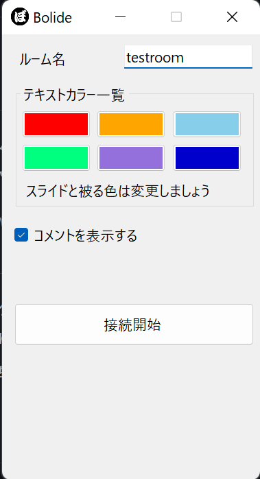
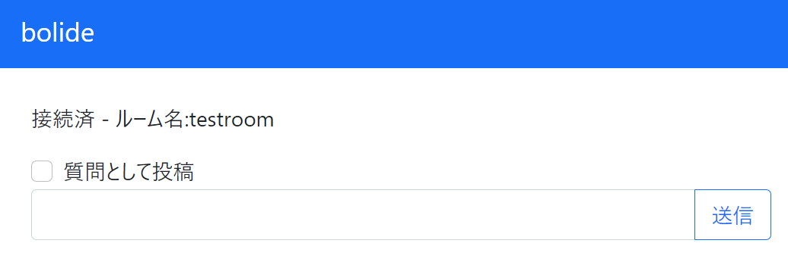

# bolide

## bolideとは？

匿名でZoomなどで画面共有をしている配信者の画面にコメントをニコニコ動画のように流せるソフトです。  
コメントはサーバー側で一切保存されないので安心してコメント投稿が可能です。  

### 配信者側(画面共有をしているユーザー)

配信者側はRelease内より最新のデスクトップクライアントをダウンロードして実行します。
アプリを起動するとルーム名を入力する箇所があるのでルーム名を入力します。（ルーム名は自由に設定が可能です）
`接続開始`を押すことでサーバーに接続され、コメントが投稿されると文字が流れはじめます。

### 閲覧者側(コメントを投稿するユーザー)

閲覧者は[bolide.digicre.net](https://bolide.digicre.net)より  
部屋名を入力し`接続`をクリックすることで部屋に接続することが出来ます。

質問として投稿する場合は`質問として投稿`のチェックボックスをチェックします。

また、配信者は閲覧者が簡単に対象のルームにアクセスできるようにクエリパラメーター付きURLを配ることで対象のルームへの誘導が可能です。  
例) [bolide.digicre.net/?roomname=testroom](https://bolide.digicre.net/?roomname=testroom) (testroomに移動する)  

## 使用技術

- コメント送信Webページ
    - BlazorWebAssembly
    - .NET 5
- デスクトップクライアント
    - WindowsForm
    - .NET 5
- 通信用サーバー
    - Flask